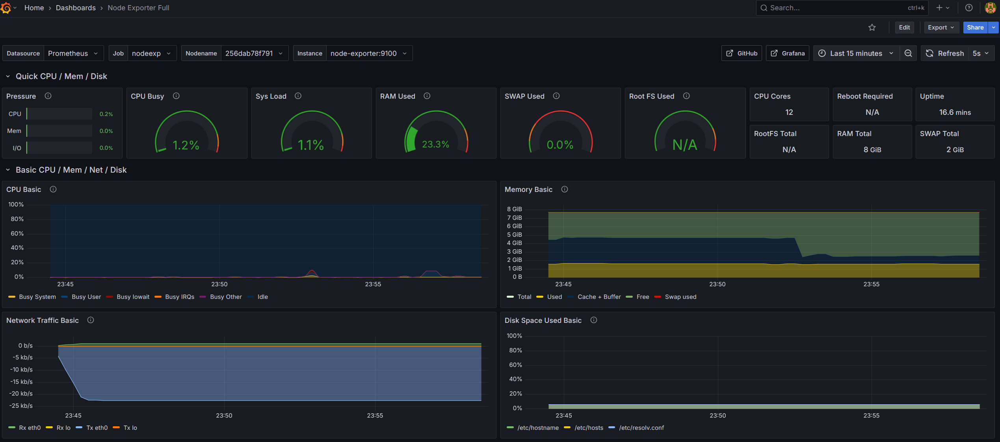
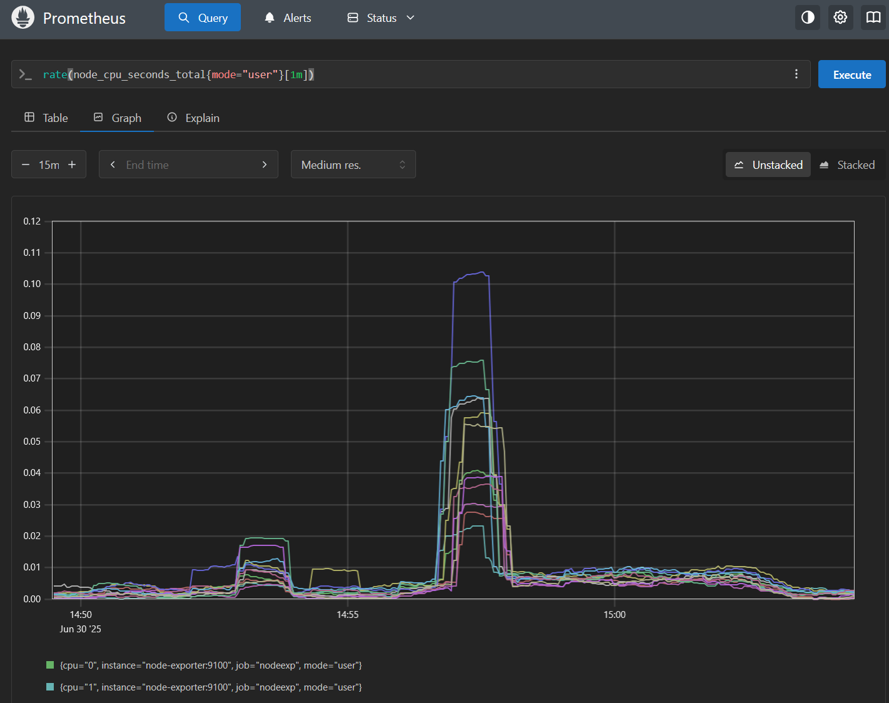
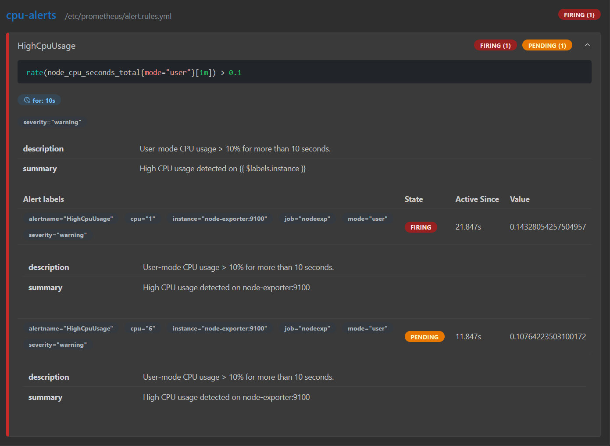
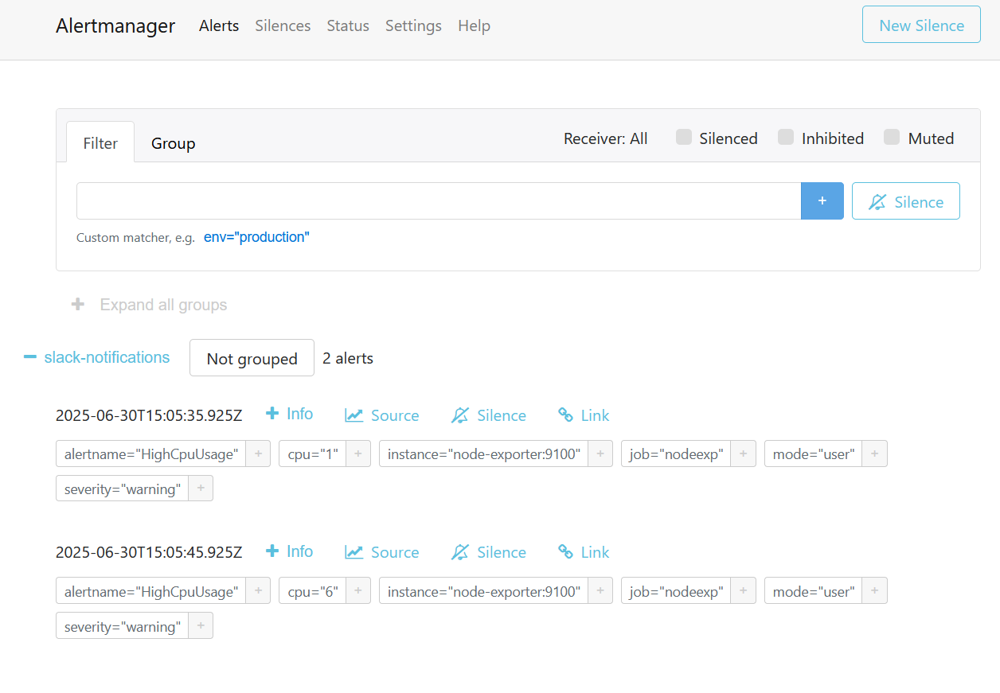
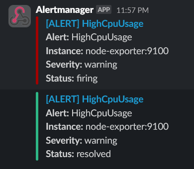
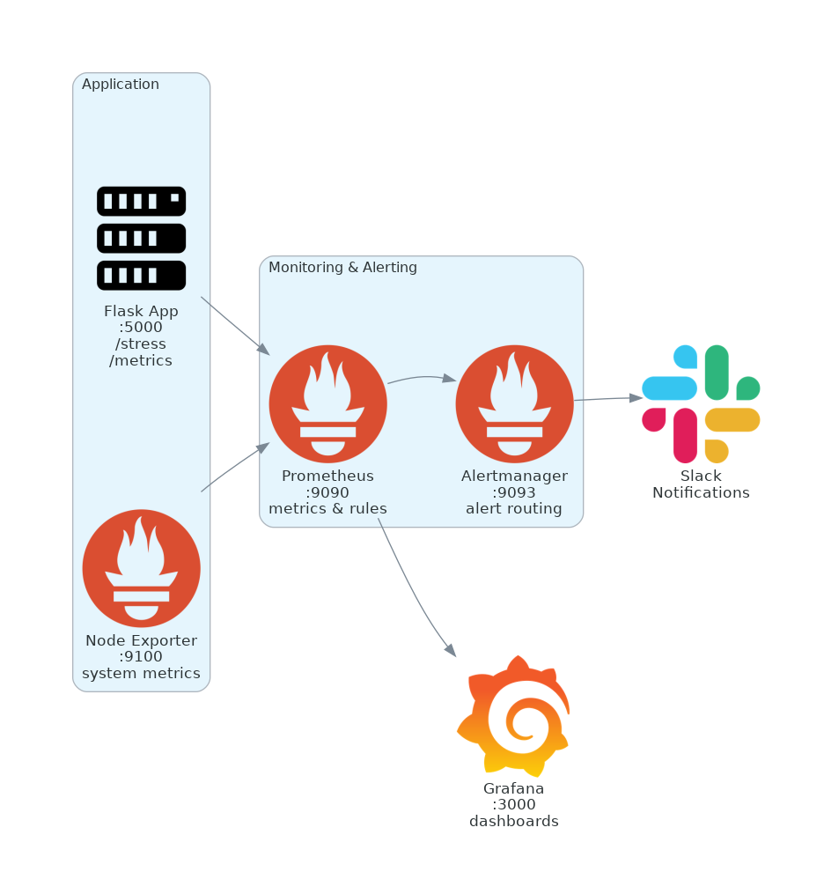

# incident-sandbox

This project simulates a simple SRE environment with basic monitoring and alerting.

It includes a minimal Flask app that generates controlled CPU load.
The system is monitored using Prometheus and Node Exporter, with alerts routed through Alertmanager to Slack.

## Purpose

This is a self-contained portfolio project demonstrating:

- Building a minimal observability stack in Docker
- Defining metrics and alert rules in Prometheus
- Simulating and detecting system resource usage
- Sending alerts via Alertmanager + Slack integration

This project is not intended for production use.

## Stack

- Python (Flask)
- Docker & Docker Compose
- Prometheus
- Node Exporter
- Alertmanager
- Grafana (preloaded with the official Node Exporter Full dashboard [ID: 1860](https://grafana.com/grafana/dashboards/1860-node-exporter-full/))
- Slack (incoming webhook for alert delivery)

## Getting Started

1. **Clone and set up**:
   ```bash
   git clone <repository-url>
   cd incident-sandbox
   cp .env.example .env
   # Add your Slack webhook URL to .env
   ```

2. **Generate the Alertmanager config**:
   ```bash
   ./gen-alert-cfg.sh
   ```

3. **Start everything**:
   ```bash
   docker-compose up -d
   ```

4. **Check it out**:
   - Flask App: http://localhost:5000
   - Prometheus: http://localhost:9090
   - Grafana: http://localhost:3000
   - Alertmanager: http://localhost:9093

5. **Trigger an alert**:
   ```bash
   curl http://localhost:5000/stress/30
   ```
   Then watch the alert flow through the system to Slack.

## Screenshots

### Grafana Dashboard


### Prometheus Metrics


### Alert Management




### Slack Notifications


## How It Works

### Alert Rules
CPU usage > 10% for more than 10 seconds will trigger an alert. This threshold is intentionally low to make testing easier.

### Stress Testing
The Flask app has a `/stress` endpoint that generates CPU load:
- `/stress` - Runs for 30 seconds by default
- `/stress/<duration>` - Set a custom duration (max 120 seconds)

It uses multiple threads to ensure enough load is generated to trigger alerts.

### Configuration
The project uses a template system for sensitive values:
- Your Slack webhook URL goes in `.env`
- `gen-alert-cfg.sh` generates the Alertmanager config
- The generated file is git-ignored for security

## Architecture



## Project Structure

```
incident-sandbox/
├── app/                   # Flask application
├── prometheus/            # Prometheus config & alert rules
├── alertmanager/          # Alertmanager config & template
├── grafana/               # Grafana dashboards & datasources
├── img/                   # Screenshots
├── gen-alert-cfg.sh       # Config generator
├── docker-compose.yml     # Service definitions
├── .env.example           # Template for environment vars
└── .env                   # Your environment (git-ignored)
```

## License

MIT
